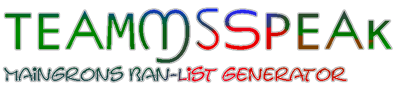
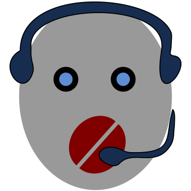
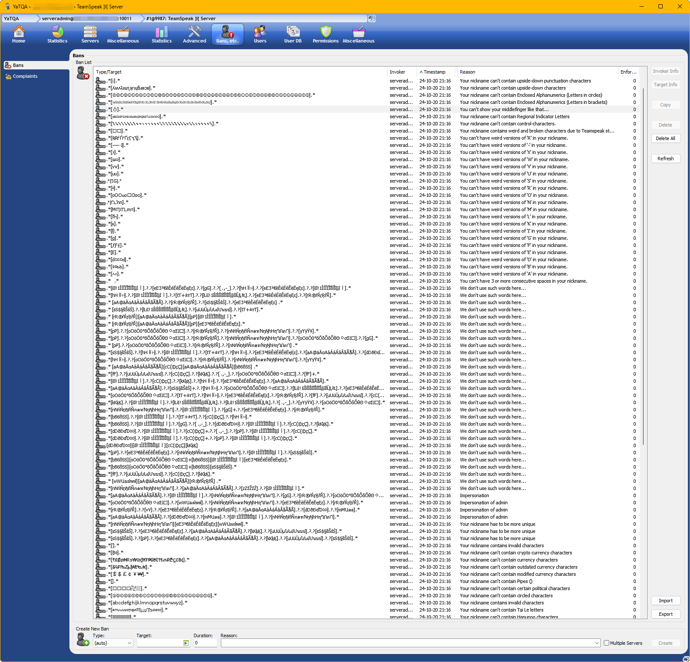

# Maingrons teamspeak-ban-list generator
This tools generates Regex Ban lists for TeamSpeak that you can import with YaTQA. ...These TeamSpeak limitations are crazy!

## How to
After downloading and extracting, open the index.html file on your computer (with your browser). It will output a YaTQA file with ban rules (You'll have to save the text output into a file yourself, sorry!)

You can edit the rules in the JavaScript files. You're probably looking for `const words` in input.js. Maybe you'll also want to change `var charsetCollection` in generateCharsetBan.js.

Make sure to open your browser console (CTRL + I) to monitor for errors. Queries get too long for TeamSpeak basically immediately - This is also the reason for banning some charsets within charsetCollection, so we don't have to check for all of these "fake" letters later.

.ybl files are meant to be "YaTQA Import List"

Contributions and questions welcome.

## Further steps
Depending on your configuration, you can take further steps to harden your TeamSpeak server.
Some examples:
- Fail2Ban (with TeamSpeak configuration)
- Moderators

## Special things when adding words
- Make sure to watch the browser console for errors
- Writing `+` results in regex +, meaning the previous character (or character group) can follow unlimited times

## Example lists
You can find example lists in the example lists-directory. Note: If you use the generation tool, you'll automatically obtain these with your result.

Here's a brief description for each one:
- [control and broken characters.ybl](example%20lists/control%20and%20broken%20characters.ybl) - TeamSpeak translates some characters incorrectly, also control characters aren't really a thing you want. It's recommended to use this list.
- [fake characters.ybl](example%20lists/fake%20characters.ybl) - Bans characters that look like the actual characters but are actually different
- [foreign charsets.ybl](example%20lists/foreign%20charsets.ybl) - Bans characters that represent a letter, but are clearly distinguishable. For example subscript, upside down 

## Screenshots
|  |  |
|--|--|
|||

## Coverage
Some project coverage:
- [Ko-Fi Release Post](https://ko-fi.com/post/TeamSpeak-Ban-List-Generation-Tool-L3L2150LJK)
- [Patreon Release Post](https://www.patreon.com/posts/teamspeak-ban-114384632)
- [Bluesky Release Post](https://bsky.app/profile/maingron.bsky.social/post/3l6xxm2vi4f2x)

-----

## Teamspeak and YaTQA documentation
Information about Teamspeak / Teamspeak Bans I was able to conclude myself while working on this

### Valid Regex Patterns
- `.*` -> anything at any length
- `.?` -> can be 1 or 0 characters
- `\s` -> exactly 1 space
- `\d` -> appears to be numeric (unconfirmed)
- `n{1,3}` -> defines the length of n (unconfirmed)
- `[aA89]` -> one of these

### Other limitations
- Max length of 255. Database entries that are longer will be ignored

### Well, YaTQA...
YaTQA actually seems to have its own problems. While this project is aimed to work with YaTQAs import function, YaTQA seems to dislike certain characters. In doubt you'll have to add certain entries using the TeamSpeak client itself

Errors I received in YaTQA:
- 1538
- 1541 - Invalid Parameter size
- 1540 - Convert Error
- 524 - Client is flooding

### Useful links
- http://yat.qa/resources/server-error-codes/
- https://ts3index.com/blog/373-regeln-fuer-ungueltige-unerlaubte-channel-und-nicknamen/
- https://util.unicode.org/UnicodeJsps/confusables.jsp
